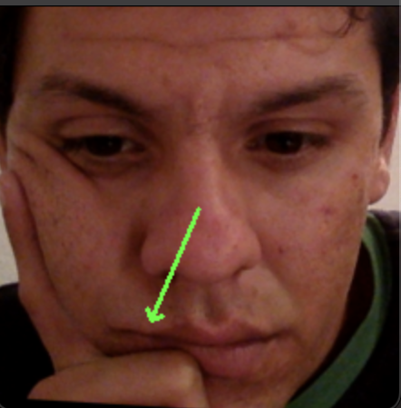

# Deep Learning Face Gaze Estimation
A PyTorch reference implementation of the thesis "Exploring The Influence of Facial Features Beyond the Eyes on Gaze Estimation". This work employs the MPIIFaceGaze dataset [\[perceptualui.org\]](https://perceptualui.org/research/datasets/MPIIFaceGaze/) to study the impact, by means of identification and quantification, of different facial features toward the accuracy of gaze estimation. Other datasets can be utilized as well. The paper is accessible at [\[repository.tudelft.nl\]](http://resolver.tudelft.nl/uuid:df5c46b3-c9ec-4c88-8f73-32c03526be38).
<p align="center">
    
    
    
    <em>Inference examples using MPIIFaceGaze Dataset. From left to right, participant ids are 14, 12, and 8 respectively.</em>
</p>


# Installation
Clone the repository
```bash
git@github.com:tanmnguyen/DLFaceGazeEstimation.git
```
Change to directory path and install the required packages (virtual environment recommended).
```bash
cd DLFaceGazeEstimation/
pip install -r requirements.txt
```
# Inference 
To infer gaze from a given image, execute the following CLI:
```bash
python infer.py --model path/to/model.pt --image path/to/image
```
- `--model` specifies the path to model weight 
- `--image` specifies the path of inference image 
# Training
To run the training program with the eye-only model:
```bash
python train.py --data path/to/training/data --type eye --epochs 20 --testid 14
```
To run the training program with full face model:
```bash
python train.py --data path/to/training/data --type face --epochs 20 --testid 14
```
The `testid` argument specifies the test subject. The training will be performed on the remaining 14 test subject data. The best model is considered and saved at epoch frequency, the saved model can be found at `./trains/`

# Testing 
The testing includes calibration (fine-tuning) before evaluation, which first train the model on 10% of the testing data and the remaining 90% is used to test the model. 

Run the following CLI to test the model on a specific test subject. 
```bash
python test.py --data path/to/data --model path/to/model.pt --testid 0
```
- `--data` specifies the path to the dataset 
- `--model` specifies the path to pre-trained weight.

The work proposed in the paper further employs the rectangular mask to assess the model performance given the inclusion/exclusion of some facial features. To implement the testing with mask, execute the following CLI.
```bash
python test.py --data path/to/data --model path/to/model.pt --testid 0 --mask path/to/mask.npy --mode [positive/negative]
```
Where the new arguments:
- `--mask` specifies the path to npy rectangular mask file, containing data of shape (n, 4). 
- `--mode` specifies whether to use inclusion or exclusion facial feature mode, corresponding to positive and negative respectively. 

# Intepretation 
To compute the heat map using the method proposed by the paper, execute the following command:
```bash 
python interpret.py --data path/to/data --model path/to/model.pt --testid id
```
- `--data` specifies the path to the dataset.
- `--model` specifies the path to pre-trained model weight 
- `--testid` specifies the testid (type int) to generate the heatmap. 

<p align="center">
    
    <em>Interpretation example using MPIIFaceGaze Dataset using test subject id 14.</em>
</p>

# References
[Zhang, X., Sugano, Y., Fritz, M., & Bulling, A. (2019). MPIIGaze: Real-World Dataset and Deep Appearance-Based Gaze Estimation. *IEEE Transactions on Pattern Analysis and Machine Intelligence (TPAMI)*, 41(1), 162-175.](https://doi.org/10.1109/TPAMI.2017.2778103)

[Zhang, X., Sugano, Y., Fritz, M., & Bulling, A. (2017). It's Written All Over Your Face: Full-Face Appearance-Based Gaze Estimation. In *Proc. IEEE Conference on Computer Vision and Pattern Recognition Workshops (CVPRW)* (pp. 2299-2308).](https://doi.org/10.1109/CVPRW.2017.284)

[Zhang, X., Sugano, Y., Fritz, M., & Bulling, A. (2017). It's Written All Over Your Face: Full-Face Appearance-Based Gaze Estimation. In *2017 IEEE Conference on Computer Vision and Pattern Recognition Workshops (CVPRW)* (pp. 2299-2308).](https://doi.org/10.1109/cvprw.2017.284)


[Zeiler, M. D., & Fergus, R. (2013). Visualizing and Understanding Convolutional Networks. arXiv preprint arXiv:1311.2901.](https://arxiv.org/abs/1311.2901)
